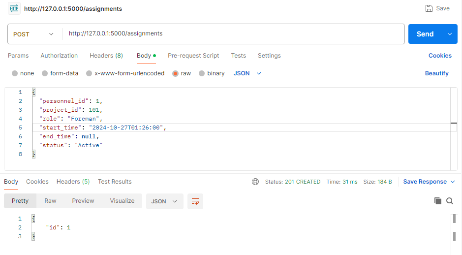
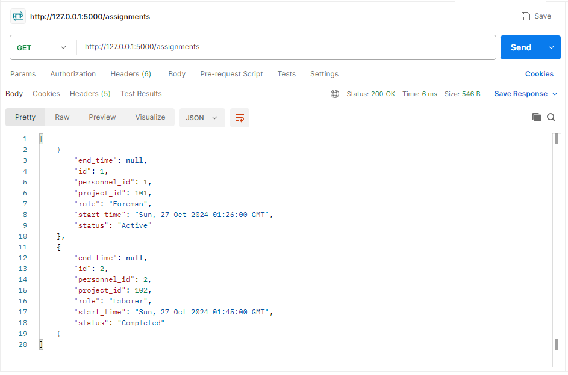
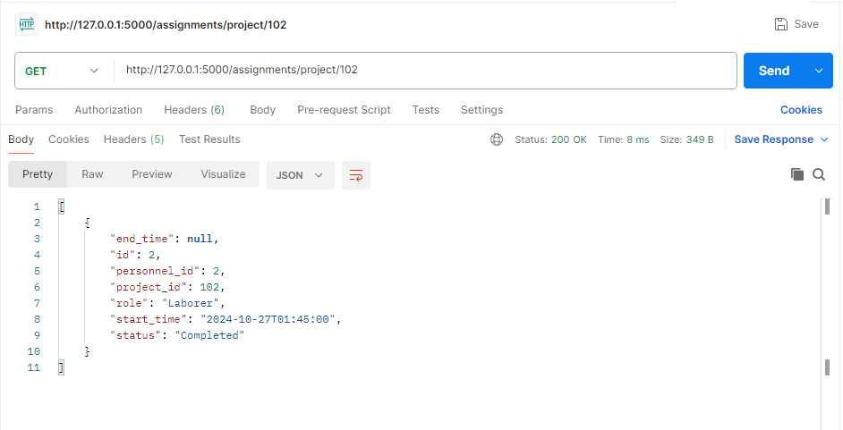
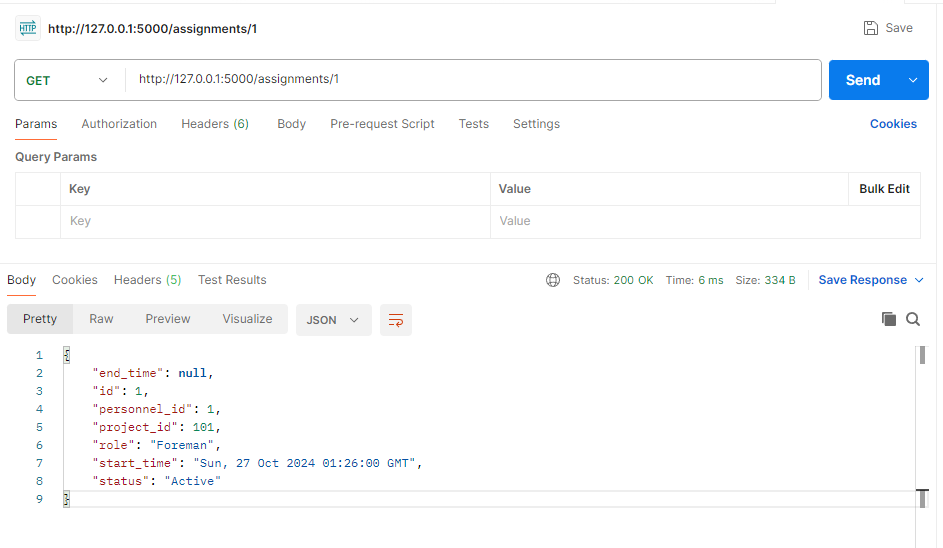
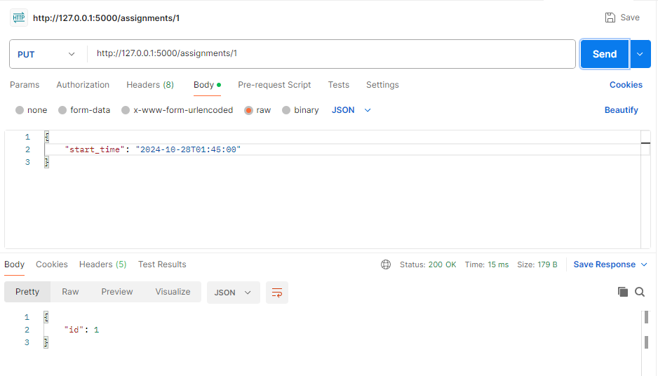
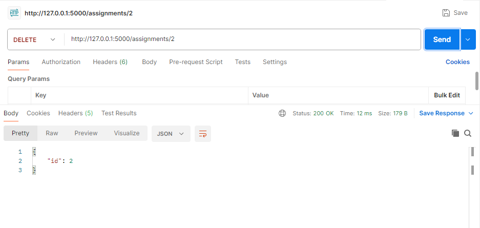

**Personnel Dispatching API**

This is a RESTful API for managing personnel assignments to construction projects. It allows users to create, retrieve, update, and delete personnel assignments for various projects.

**Features**
1) Create a new personnel assignment.
2) Retrieve a list of all assignments or filter assignments by specific project.
3) Retrieve a specific assignment by ID.
4) Update an assignment.
5) Delete an assignment.

**Technology Stack**
1)Flask - Web framework for Python.
2)Flask-SQLAlchemy - ORM for database interaction.
3)SQLite - Database for local data storage.

**Requirements**
1)Python 3.7 or later
2)Flask and Flask-SQLAlchemy packages

**Installation**
1) Clone the Repository:

    1)``` git clone https://github.com/tabishmomin415/Personnel-Dispatching-API_Task-1.git
    2)``` cd Personnel-Dispatching-API_Task-1

2) Set Up Virtual Environment:

    1) Install Virtual Environment:
       ```pip install virtualenv  
    2) create a virtual environment named env:
       ```virtualenv env
    3) Activate the Virtual Environment:
       ```.\env\Scripts\Activate.ps1

4) Install Dependencies:

    pip install -r requirements.txt

5) Create the SQLite Database: The database will be created automatically on the first run.

**Run the Application**
    
    python app.py

**API Endpoints**

1) Create a New Assignment (Post):

    URL: http://127.0.0.1:5000/assignments

    

2) Retrieve All Assignments (Get):
 
    URL: http://127.0.0.1:5000/assignments

    

3) Retrieve Assignments by Project ID:
 
    URL: http://127.0.0.1:5000/assignments/project/102

    

4) Retrieve an Assignment by ID:

    URL: http://127.0.0.1:5000/assignments/1

    

5) Update an Assignment (Put):

    URL: http://127.0.0.1:5000/assignments/1

    

6) Delete an Assignment (Delete):

    URL: http://127.0.0.1:5000/assignments/2

    

